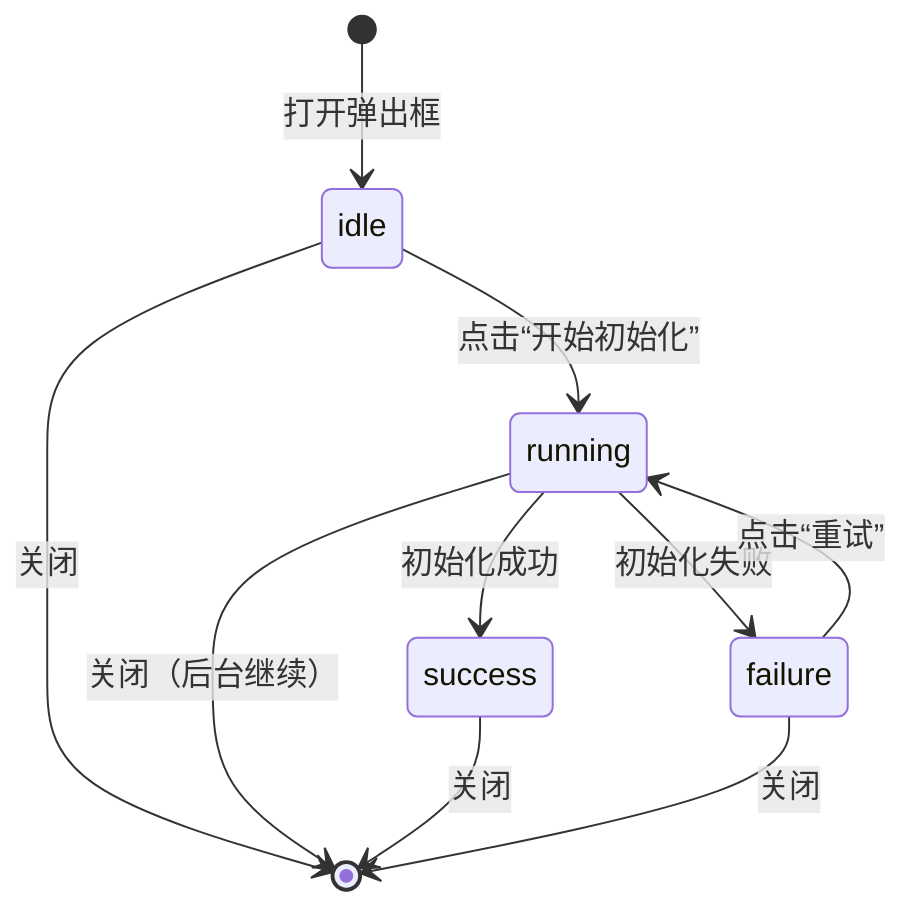

# 设计方案

> Story：STORY-000014(左区初始化引导)
> 状态：编写中

## 架构概述

在左栏既有「SPECWAVE 工作区」内新增“未初始化态 + 初始化引导弹出框”的展示与交互，所有初始化执行仍由运行时完成；界面侧只渲染 `ViewModel`：视图模型，并通过 `dispatch(intent)`：派发意图 触发流程，确保与 `CLI`：命令行 初始化口径一致。

## 现状调研（只读）

### 现有入口与现有提示

- 左栏既有「SpecWave 工作区」入口在 `packages/ui-next/src/panels/left/LeftPanel.tsx:422`。
- 当前用 `props.explorer.workspaceRoot` 是否存在，决定展示工作区树；若为空则展示占位提示：`packages/ui-next/src/panels/left/LeftPanel.tsx:427`。
- 这条占位提示已经明确表达“未初始化/不是 SpecWave 项目”，适合作为“未初始化态”的 UI：界面容器分支，只需把纯文本升级为引导卡片 + 初始化按钮。

### 现有状态来源（未初始化判定）

- `workspaceRoot`：工作区根目录在 `apps/desktop/src/renderer/src/store.ts:477` 的注释里被明确为 `.specwave/workspace`。
- 因此当前 UI 的“未初始化态”可直接按 `explorer.workspaceRoot === null` 判定，不需要让左栏自行读文件。

### 现有运行时能力（`IPC`：进程间通信）

- 预加载脚本已暴露 `window.specwave`：`apps/desktop/src/preload/index.ts:46`，并包含文件读取能力（如 `readDirectory`、`readTextFile`）：`apps/desktop/src/preload/index.ts:58`、`apps/desktop/src/preload/index.ts:60`。
- 主进程已注册对应的 `IPC`：进程间通信 通道（如 `specwave:readDirectory`、`specwave:readTextFile`）：`apps/desktop/src/main/ipc.ts:217`、`apps/desktop/src/main/ipc.ts:226`。
- 目前尚无“初始化引导”专用通道；需要新增一组结构化进度事件/结果事件，避免 UI：界面 解析纯文本。

### 文件规模（用于决定是否拆分）

为避免继续在“大文件”里堆逻辑，执行阶段建议按组件/处理器拆分：

- `packages/ui-next/src/panels/left/LeftPanel.tsx`：513 行（已包含多组 Sidebar 渲染与右键菜单逻辑）
- `apps/desktop/src/renderer/src/store.ts`：1641 行（体量较大，新增状态机建议下沉到独立 handler）
- `apps/desktop/src/renderer/src/store/handlers/explorer.ts`：846 行
- `apps/desktop/src/renderer/src/store/handlers/project.ts`：548 行
- `packages/contracts/src/index.ts`：317 行
- `apps/desktop/src/preload/index.ts`：142 行
- `apps/desktop/src/main/ipc.ts`：330 行

## 组件职责

| 组件 | 职责 | 边界 |
|------|------|------|
| 左栏 SPECWAVE 工作区视图（UI） | 根据 `SpecWaveWorkspaceVM` 渲染“未初始化卡片 / 已初始化内容 / 初始化弹出框” | 不接触文件系统与命令执行；不引入中栏/右栏 |
| 初始化引导弹出框（UI） | 展示步骤指示区、进度、日志摘要、成功/失败提示与重试 | 只消费 `InitWizardVM`；不解析命令输出 |
| `@specwave/contracts`：交互契约 | 定义 `UIIntent`：界面意图 与 `ViewModel`：视图模型 字段 | 只放类型，不放实现 |
| `renderer`：渲染侧 `store`：状态编排（实现侧） | 接收 `UIIntent`：界面意图，调用运行时能力并把状态汇总为 `ViewModel`：视图模型 | 业务编排集中在 `store`：状态编排，不进 UI |
| `preload/main`：桥接与主进程（实现侧） | 复用 `CLI`：命令行 初始化能力，产出结构化进度事件 | 不把业务逻辑放到 UI；错误语义结构化返回 |
## 数据模型

```ts
// 左栏工作区
export type SpecWaveWorkspaceVM = {
  title: 'SPECWAVE'
  statusBadge?: { text: string; tone: 'neutral' | 'info' | 'success' | 'danger' }
  mode: 'ready' | 'uninitialized'

  // 未初始化态
  uninitialized?: {
    title: string
    description: string
    primaryCtaText: string
    note?: string
  }

  // 初始化引导弹出框
  initWizard?: InitWizardVM
}

export type InitWizardVM = {
  isOpen: boolean
  phase: 'idle' | 'running' | 'success' | 'failure'
  steps: Array<{
    key: 'check' | 'createWorkspace' | 'writeConfig' | 'verify'
    title: string
    status: 'todo' | 'doing' | 'done' | 'error'
  }>
  progress?: { percent: number; label?: string }
  logs: Array<{ level: 'info' | 'warn' | 'error'; text: string; time?: string }>
  error?: { title: string; detail?: string; canRetry: boolean; copyText?: string }
  actions: { canClose: boolean; canRetry: boolean }
}
```

## 关键技术决策

| 决策点 | 选择 | 理由 |
|--------|------|------|
| 初始化执行位置 | 放在运行时（preload/main） | UI 不接触文件系统与命令执行，符合解耦门禁 |
| 进度与日志承载 | 用结构化事件更新 `InitWizardVM` | 避免 UI 解析文本输出，失败语义更稳定 |
| `CLI`：命令行 对齐 | 复用同一初始化入口（实现侧抽成可复用模块） | “一个事实源”，避免 UI 和 `CLI` 分叉 |
| 弹出框组件 | 统一用 `shadcn/ui`：组件库 | 交互一致、无障碍更稳，后续维护成本更低 |

## 交互与界面（简要口径）

视觉风格按现有 `Flat`：扁平 口径收敛：信息层级清晰、留白克制、强调主按钮，避免同时出现过多强色。

- 左栏未初始化卡片
  - 标题：例如“这个项目还没初始化”
  - 描述：一句话说明“初始化会生成 `.specwave/` 并准备工作区”
  - 主按钮：初始化
  - 次级信息：提示初始化是可重试操作；失败会给出错误信息

- 初始化引导弹出框
  - 顶部：标题 + 关闭
  - 内容区三段：
    1) 步骤指示区（最多 4 步，横排或竖排）
    2) 进度条 + 当前步骤文案
    3) 日志摘要（可滚动，默认最多展示最近 N 行）
  - 底部：主按钮随状态变化（运行中禁用、成功显示完成、失败显示重试）

无障碍（`a11y`：无障碍）最小要求：弹出框打开后焦点可达主按钮；键盘可关闭；日志区可滚动但不抢焦点。

### 弹出框简要图（效果口径）

左栏“初始化”按钮只负责打开弹出框；弹出框里再点“开始初始化”才会真正执行，口径对齐 `CLI`：命令行 的“先展示计划，再确认落盘”。

```text
┌─ 左栏：SPECWAVE 工作区 ───────────────────────┐
│  [未初始化] 这个项目还没初始化               │
│  初始化会生成 .specwave/ 与工作区目录         │
│  ┌─────────────────────────────────────────┐ │
│  │ 说明：执行可重试；失败可复制错误信息       │ │
│  └─────────────────────────────────────────┘ │
│  [ 初始化 ]（点击后：只打开弹出框）           │
└──────────────────────────────────────────────┘

                  ↓

┌─ 弹出框：初始化 SpecWave ─────────────────────┐
│ 流程对齐 CLI，执行中持续输出进度与日志         │
│ [1 检查环境] [2 生成初始化计划] [3 写入文件]… │
│ 进度：xx%  当前步骤：xxxx                     │
│ ──────────────────────────────────────────── │
│ 日志摘要（可滚动，默认只保留最近 N 行）        │
│ [info] ...                                   │
│ [warn] ...                                   │
│ [error] ...（失败时：显示错误框 + 复制错误）   │
│ ──────────────────────────────────────────── │
│ [关闭] [开始初始化/重试/完成]                 │
└──────────────────────────────────────────────┘
```

### 状态流转简图（store 状态机）



## 拆分建议（避免继续堆在大文件）

- 左栏（`LeftPanel.tsx`）：建议把“SpecWave 工作区”这一组渲染抽成独立组件文件（例如 `SpecWaveWorkspaceGroup.tsx`），再把“未初始化卡片”“初始化弹出框”继续拆成 1~2 个更小组件，保持单文件职责单一。
- 状态编排（`store.ts`）：建议新增独立 `handler`：处理器（例如 `store/handlers/specwaveInit.ts`）承载初始化意图与状态机，把新增逻辑限制在可控文件范围内；`store.ts` 只做注册与桥接。

## 组件清单（`shadcn/ui`：组件库）

- 左栏卡片：`Card`：卡片、`Badge`：徽标、`Button`：按钮
- 弹出框：`Dialog`：对话框（含标题、内容区、底部按钮区）
- 步骤指示区：`Badge`：徽标 + `Separator`：分隔（或后续自绘轻量步骤条）
- 进度：`Progress`：进度条
- 日志摘要：`ScrollArea`：滚动区（或等价滚动容器）
- 失败提示：`Alert`：提示框（含“复制错误”“重试”按钮）

## 交互契约包（涉及接口对接时必填）

契约文件：`refs/contracts/specwave-init.md`

### UIIntent（界面意图）清单

- `SPECWAVE_INIT_OPEN`：打开初始化弹出框
- `SPECWAVE_INIT_START`：开始初始化
- `SPECWAVE_INIT_RETRY`：失败后重试
- `SPECWAVE_INIT_CLOSE`：关闭弹出框
- `SPECWAVE_INIT_COPY_ERROR`：复制错误信息（仅触发提示，不承载业务）

### 运行时事件（实现侧到 UI）

- `SPECWAVE_INIT_PROGRESS`：步骤状态变更、进度百分比、日志追加
- `SPECWAVE_INIT_RESULT`：成功/失败结果（含错误语义、是否可重试）

## 风险与依赖

- 需要实现侧确认：`CLI`：命令行 的初始化入口是否可直接复用（优先复用函数/模块，而不是解析纯文本输出）。
- 初始化可能是长任务：需要进度事件节流与日志行数上限，避免 UI 卡顿。
- 失败语义要结构化：错误标题/详情/可重试，避免只有一串文本导致交互不可控。
