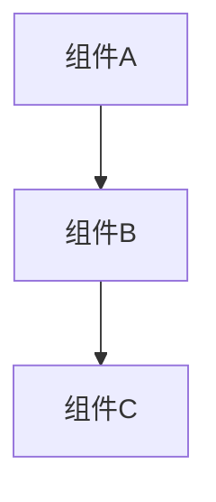

# 设计文档

## 概述
{{DESIGN_SUMMARY}}

## 架构



## 组件与接口

### 组件 1：{{COMPONENT_NAME}}
- 职责：{{RESPONSIBILITY}}
- 依赖：{{DEPENDENCIES}}
- 被依赖：{{DEPENDENTS}}

### 接口定义
```typescript
interface {{INTERFACE_NAME}} {
  {{INTERFACE_CONTENT}}
}
```

## 数据模型

### 数据结构
```typescript
type {{TYPE_NAME}} = {
  {{TYPE_CONTENT}}
}
```

### 状态管理
{{STATE_MANAGEMENT}}

---
> 模板说明：架构图可选，组件要说明职责和依赖关系。
